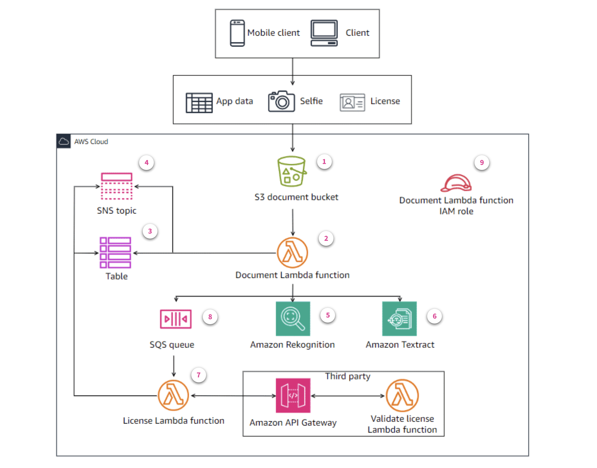

# Serverless Customer Onboarding Application

## Project Overview
A serverless application built on AWS that automates the customer verification process using document validation, face comparison, and license verification. The application uses various AWS services to create a robust, scalable, and secure customer onboarding workflow.


## Architecture



### AWS Services Used
- **AWS Lambda Function:**
 Unzips and processes the information submitted by customers. The function extracts data such as name, address, and date of birth, comparing it with the stored customer information. It also sends requests to Amazon Rekognition, Amazon Textract, and Amazon Simple Queue Service (SQS) for additional validation.

- **Amazon S3:** 
Stores the application data submitted by customers to the bank.

- **Amazon DynamoDB:** Stores the information submitted by customers through the application.

- **Amazon SNS:** Sends notifications regarding the status of customer applications.

- **Amazon SQS:** Queues requests for the driver's license API solution.

- **AWS Step Functions:** Orchestrates workflows and coordinates the sequence of services involved in the solution.

- **AWS SAM (Serverless Application Model):** Simplifies the deployment and management of serverless applications.

- **AWS Identity and Access Management (IAM):** Assigns an IAM role to each Lambda function in the solution, adhering to the principle of least privilege.

- **Amazon Rekognition:** The Lambda Function call Amazon Rekognition to compare the customer's submitted selfie and driver's license photos. Based on the comparison results, the function updates the DynamoDB table and sends notifications via Amazon SNS.

- **Amazon Textract:** The Lambda function will call Amazon Textract to verify that the data extracted from the driver's license image matches the customer's submitted details.

- **Amazon API Gateway:** Simulates a third-party service to validate the customer's driver's license using Amazon API Gateway and Lambda. 
An API that uses API Gateway will represent the API that will receive the license validation request from your solution. 
A backend Lambda function will simulate the verification of the license.

- **AWS X-Ray:** Monitors the state machine workflow and provides traceability for each of its states.


## Lambda Functions
1. **UnzipLambdaFunction**
   - Handles document extraction from uploaded zip files
   
2. **WriteToDynamoLambdaFunction**
   - Manages customer metadata storage in DynamoDB

3. **CompareFacesLambdaFunction**
   - Performs facial recognition comparison

4. **CompareDetailsLambdaFunction**
   - Validates customer details

5. **ValidateLicenseLambdaFunction**
   - Exposes HTTP API endpoint for license validation

6. **SubmitLicenseLambdaFunction**
   - Processes license submissions from SQS queue


## Setup and Deployment

### Initial Setup
1. Clone the repository
2. Install required dependencies
3. Configure AWS credentials
4. Update configuration files

### Deployment Steps
1. Build the SAM application:
```bash
sam build

```
2. Deploy the Application
```bash
sam deploy --guided
```

3. Verify the Deployment:
```bash
aws cloudformation describe-stacks --stack-name <your-stack-name>
```


